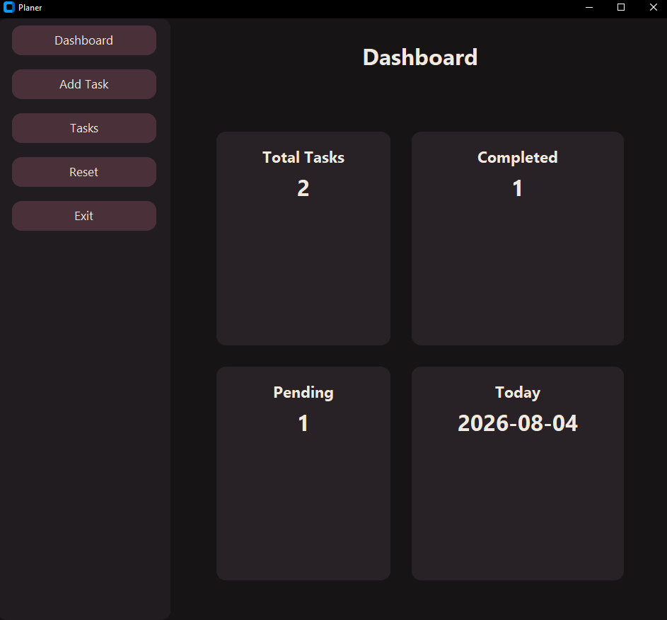
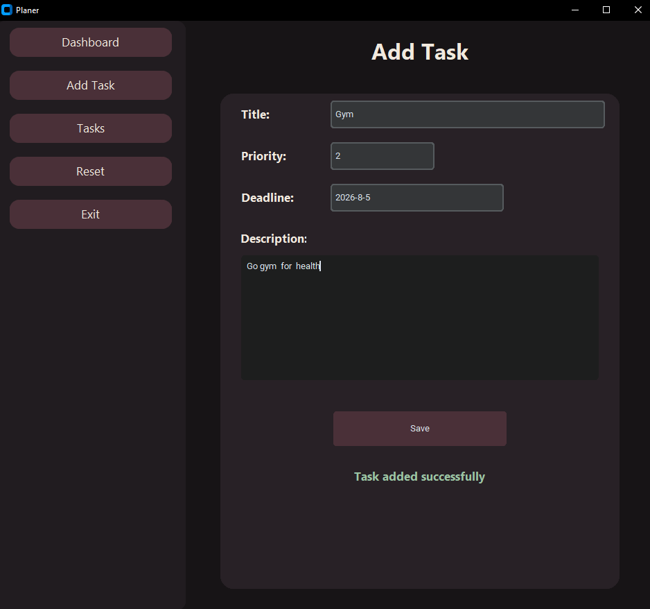
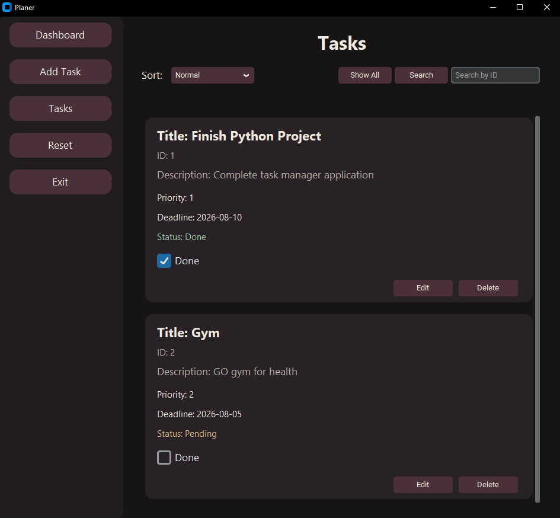
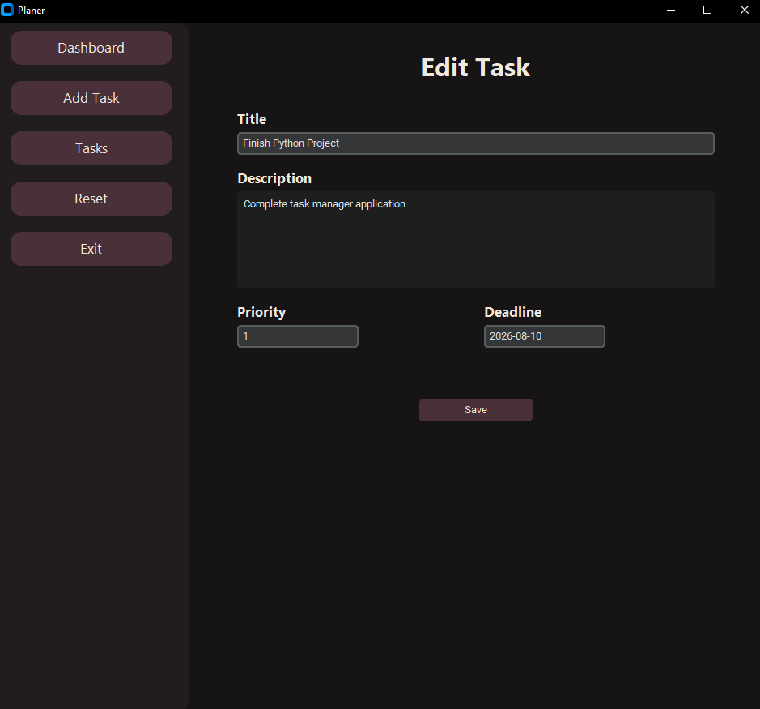

# Planer - Task Management Application

A modern desktop Task Management application built with Python and CustomTkinter.

The application allows users to create, edit, delete, search and organize their tasks with a clean dark UI.

---
## Download

[Download the latest release)[https://github.com/AlirezaAmiri01/Programming-Planer/releases/download/V1.0.0/My.Planner.exe] — Windows `.exe`, no installation needed.

##  Project Preview

### Dashboard



### Add Task



### Tasks Page



### Edit Task




---

#  Features

## Task Management

- Create new tasks
- Edit existing tasks
- Delete tasks
- Mark tasks as completed or pending
- Store tasks permanently


## Search & Sorting

- Search tasks by ID
- Sort tasks by:
  - Status
  - Priority
  - ID
  - Deadline
- Return to normal view with Show All button


## Validation

- Validate title
- Validate description
- Validate priority input
- Smart date validation

Accepted date formats:
2026-8-8


The application automatically handles date formatting.


## Error Handling

- Corrupted or invalid rows in the CSV file are skipped instead of crashing the app
- Invalid dates and priorities are caught and reported to the user, not thrown as raw exceptions


## Dashboard

Dashboard provides an overview of:

- Total tasks
- Completed tasks
- Pending tasks
- Current date


## RUN

### Installation

Clone the project:

```bash
git clone https://github.com/AlirezaAmiri01/Programming-Planer.git
```

Go into the project directory, then install requirements:

```bash
pip install -r requirements.txt
```

Run:

```bash
python main.py
```

### Run tests

```bash
python -m unittest tests.test_manager
python -m unittest tests.test_validation
```

> Note: some tests call `reset_all_tasks()`, which clears all tasks. Back up `task.csv` before running tests if you have real data you want to keep.

---

## Building a standalone .exe (Windows)

This project can be packaged into a single Windows executable using [PyInstaller](https://pyinstaller.org/).

```bash
pip install pyinstaller
pyinstaller --onefile --windowed --name "Planner" --icon="assets/icon.ico" main.py
```

The finished executable will be at:

```
dist/Planner.exe
```

When running as a bundled `.exe`, the app stores `task.csv` in `%APPDATA%\Planner\` instead of next to the executable. This means the data persists correctly no matter where the `.exe` is moved or copied.

---

## Technologies

- Python
- CustomTkinter
- Object Oriented Programming
- CSV / File Storage
- Tkinter GUI
- unittest

## Future Improvements

- Replace CSV storage with SQLite
